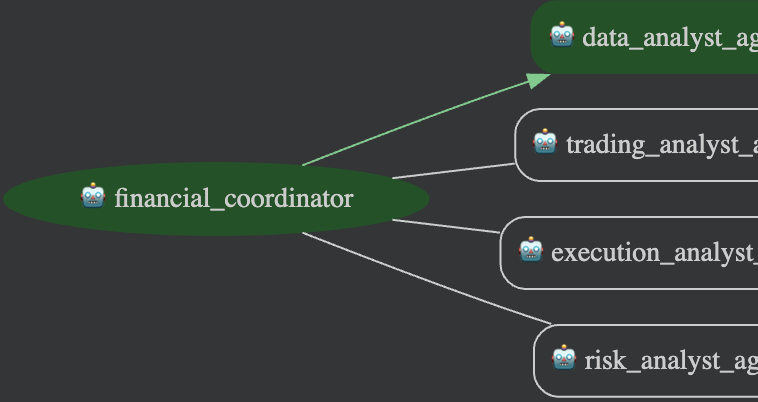

# Financial Advisor Agent

## Overview

The Financial Advisor is a team of specialized AI agents that assists human financial advisors.

1.  **Data Analyst Agent:** Creates in-depth market analysis reports for specific stock tickers using Google Search.
2.  **Trading Analyst Agent:** Develops trading strategies based on the analysis and user risk profile.
3.  **Execution Agent:** Creates a detailed execution plan (orders, timing) for the chosen strategies.
4.  **Risk Evaluation Agent:** Produces a reasoned analysis of the risks associated with the strategies and plan.

**Legal Disclaimer:** This project is for educational purposes only. It is not financial advice.

### Architecture


## Setup and Installation

**Please refer to the root [SETUP.md](../SETUP.md) for complete installation and configuration instructions.**

Key steps:
1.  Navigate to this directory: `cd financial-advisor`
2.  Install dependencies: `poetry install --with dev,deployment`
3.  Configure `.env` with Google Cloud credentials.

## Running the Agent

### 1. Full System (Recommended)
To run the agent with the **Metacognitive Control Subsystem (MCS)** safety layer enabled, use the `deploy_all.py` script from the repository root:

```bash
# From repository root
PYTHONPATH=. poetry -C financial-advisor run python3 deploy_all.py
```
This launches the Agent UI at `http://localhost:8001`.

### 2. Standalone Development (ADK CLI)
For quick testing of the agent logic *without* the full safety subsystem (note: some features may be limited), you can use the ADK CLI from this directory:

```bash
# From financial-advisor directory
adk run financial_advisor
```

## Running Tests

To verify the agent's core logic:

```bash
# From financial-advisor directory
python3 -m pytest tests
python3 -m pytest eval
```

## Deployment

The Financial Advisor can be deployed to Vertex AI Agent Engine.

```bash
poetry install --with deployment
python3 deployment/deploy.py --create
```

For more details on deployment, see the source code in `deployment/`.
